<div align="center">



<a href="https://git.io/typing-svg">
  
</a>

<br/>


<br/><br/>

<a href="https://github.com/Zidhann7"></a>
<a href="https://www.linkedin.com/in/mohammad-zidan"></a>
<a href="mailto:zidhann7@gmail.com"></a>

<br/><br/>


</div>

<br/>

## 🔮 About Me

<div align="center">

</div>

I'm a **Data Analyst** who treats messy, unstructured data as a solvable engineering problem — not just a reporting task. Across four internships, I've cleaned, modeled, and visualized **700K+ records**, translating raw tables into dashboards that stakeholders actually act on.

My core strength sits at the intersection of **statistical rigor** and **business communication**: I use Python and SQL to interrogate data, Power BI and Tableau to make it visible, and GenAI tooling to compress the time between question and insight. I care about the full pipeline — extraction, cleaning, EDA, modeling, and the final narrative that gets a decision made in a boardroom.

```yaml
role: Data Analyst
focus: [EDA, Dashboard Engineering, Predictive Modeling, GenAI-Assisted Analytics]
mindset: "Every dataset is a decision waiting to be unlocked."
```

**🎯 Open To:** Data Analyst · Business Intelligence Analyst · Business Analyst · Data Analytics Intern/Associate roles

<br/>

## 🧬 Tech Stack

<div align="center">

**Languages & Querying**


**Data & ML Libraries**


**Visualization & BI**


-217346?style=flat-square&logo=microsoftexcel&logoColor=white&labelColor=1a1a2e)


**Web & Tooling**


</div>

<br/>


## 🧠 Data Analytics & GenAI Expertise

<div align="center">

| Domain | Proficiency | Details |
|:--|:--:|:--|
| **Exploratory Data Analysis** | ●●●●● | Structured EDA workflows on multi-department, multi-source business datasets |
| **Data Cleaning & Wrangling** | ●●●●● | Improved data accuracy by **30%** on 500K+ record datasets using Python |
| **Dashboard Engineering** | ●●●●● | Built 10+ interactive Power BI / Tableau / Excel dashboards across sales, HR & e-commerce |
| **Statistical & Hypothesis Testing** | ●●●●○ | A/B testing, forecasting, and trend validation for business decision support |
| **Predictive Modeling** | ●●●○○ | Built models achieving **82% accuracy** to support business forecasting |
| **ETL & Data Modeling** | ●●●●○ | End-to-end pipelines: extraction → cleaning → transformation → visualization |
| **GenAI-Assisted Analytics** | ●●●●○ | Uses LLM tooling to accelerate data prep, reporting, and insight narratives |
| **Data Storytelling** | ●●●●● | Weekly stakeholder-facing reports and presentation decks across four internships |

</div>

<br/>


## 🚀 Featured Projects

<details>
<summary><b>📊 Job Market Intelligence Dashboard</b></summary>
<br/>

Scraped and analyzed 100+ live job listings to surface hiring trends and in-demand skills, deployed as an interactive web application for real-time exploration.

| Attribute | Detail |
|:--|:--|
| **Stack** | Python, Streamlit, Plotly, BeautifulSoup |
| **Scale** | 100+ job listings scraped & processed |
| **Performance** | Real-time interactive filtering via Streamlit |
| **Security** | Read-only public data scraping, no credential handling |
| **Impact** | Surfaced in-demand skills & hiring trends for job-seeker decision support |
| **Repository** | [github.com/Zidhann7](https://github.com/Zidhann7) |

</details>

<details>
<summary><b>💐 FNP Sales Analysis Dashboard</b></summary>
<br/>

An interactive Excel dashboard analyzing revenue, customer behavior, product performance, and sales trends for an e-commerce gifting business.

| Attribute | Detail |
|:--|:--|
| **Stack** | Microsoft Excel (Advanced formulas, Pivot Tables) |
| **Scale** | Full transactional sales dataset |
| **Performance** | Dynamic, filterable dashboard views |
| **Security** | Local, offline analysis workflow |
| **Impact** | Revealed product & customer behavior trends driving revenue |
| **Repository** | [github.com/Zidhann7](https://github.com/Zidhann7) |

</details>

<details>
<summary><b>🚖 Uber Ride Analytics Dashboard</b></summary>
<br/>

An interactive Power BI dashboard analyzing ride bookings, revenue trends, and driver/customer ratings using DAX and Power Query.

| Attribute | Detail |
|:--|:--|
| **Stack** | Power BI, DAX, Power Query |
| **Scale** | 100K+ ride bookings |
| **Performance** | Optimized DAX measures for fast dashboard refresh |
| **Security** | Aggregated, anonymized ride-level data |
| **Impact** | Surfaced revenue trends and rating patterns across drivers/customers |
| **Repository** | [github.com/Zidhann7](https://github.com/Zidhann7) |

</details>

<details>
<summary><b>🛍️ Customer Shopping Behavior Analysis</b></summary>
<br/>

Segmented customers via clustering techniques to identify high-value segments driving the majority of revenue.

| Attribute | Detail |
|:--|:--|
| **Stack** | Python, SQL, Power BI, scikit-learn |
| **Scale** | 10K+ customer records |
| **Performance** | Clustering pipeline for repeatable segmentation |
| **Security** | Anonymized customer identifiers |
| **Impact** | Identified segments contributing **~60% of revenue** |
| **Repository** | [github.com/Zidhann7](https://github.com/Zidhann7) |

</details>

<details>
<summary><b>🏬 Walmart Sales Analysis</b></summary>
<br/>

Analyzed large-scale transaction data to identify top revenue-driving categories and seasonal demand patterns.

| Attribute | Detail |
|:--|:--|
| **Stack** | Python, SQL, Power BI |
| **Scale** | 45K+ transaction records |
| **Performance** | Category-level trend analysis at scale |
| **Security** | De-identified transactional data |
| **Impact** | Identified top 5 revenue-driving categories & seasonal patterns |
| **Repository** | [github.com/Zidhann7](https://github.com/Zidhann7) |

</details>

<details>
<summary><b>🍽️ Swiggy Sales Analysis</b></summary>
<br/>

Deep exploratory data analysis on food-delivery order data across multiple states and cities.

| Attribute | Detail |
|:--|:--|
| **Stack** | Python (Pandas, Matplotlib, Seaborn) |
| **Scale** | 197K+ orders across multiple states/cities |
| **Performance** | Multi-dimensional EDA pipeline |
| **Security** | Aggregated order-level data, no PII |
| **Impact** | Uncovered customer behavior patterns & regional business insights |
| **Repository** | [github.com/Zidhann7](https://github.com/Zidhann7) |

</details>

<br/>


## 💼 Experience

### Data Analyst Intern · Analytics Career Connect
`Mar 2026 – Jul 2026 · Remote · Part-time`

Delivered end-to-end analytics support across sales and HR functions within a structured 90-day Data Analyst curriculum.

- Built 4+ interactive dashboards in Excel and Power BI, supporting reporting across 2 departments
- Performed data cleaning, EDA, and descriptive analysis using Python on structured business datasets
- Produced weekly business reports and professional presentation decks for stakeholder review

`Python` `Power BI` `Excel` `EDA` `Reporting`

<br/>

### Data Analytics Intern · KultureHire
`Jan 2026 – Feb 2026 · Remote · Part-time`

Owned end-to-end HR analytics workflow — from raw survey data to stakeholder recommendations.

- Analyzed 1,200+ survey records using Excel and SQL to identify key workforce trends
- Designed 3 Power BI dashboards tracking 8+ KPIs to support HR decision-making
- Delivered end-to-end analysis (cleaning, EDA, visualization, insights) on employee engagement data
- Identified 5 behavioural trends and presented actionable recommendations to stakeholders

`SQL` `Excel` `Power BI` `HR Analytics` `Data Storytelling`

<br/>

### Data Analytics Intern · Beat Excellence
`Jul 2025 – Dec 2025 · On-site`

Worked across the full analytics stack — cleaning, modeling, automating, and forecasting on large operational datasets.

- Processed and validated 500K+ records using Python, improving data accuracy by 30%
- Investigated large datasets using SQL and Python to surface key business trends
- Automated 5 weekly reports using Power BI and Tableau, saving 8+ hours per week
- Developed predictive models achieving 82% accuracy to support business decisions

`Python` `SQL` `Power BI` `Tableau` `Predictive Modeling`

<br/>


## 🏆 Achievements

<div align="center">

| Recognition | Details |
|:--|:--|
| 📈 700K+ Records Analyzed | Cumulative dataset scale processed across four internships |
| 🎯 30% Accuracy Improvement | Data validation & cleaning pipeline at Beat Excellence |
| ⏱️ 8+ Hours Saved Weekly | Automated Power BI/Tableau reporting pipeline |
| 🤖 82% Model Accuracy | Predictive modeling for business forecasting |
| 📊 10+ Dashboards Shipped | Across sales, HR, e-commerce, and ride analytics domains |
| 🧩 60% Revenue Attribution | Identified high-value customer segments via clustering |

</div>

<br/>


## 📜 Certifications

**Microsoft & LinkedIn**


**IBM**


**Cisco**


**Scaler**


**Deloitte / Tata / Quantum (via Forage)**


**Simplilearn**


**Analytics Career Connect**


**KultureHire**


**Analytics Vidhya & Intellipaat**


<br/>

## 📊 GitHub Analytics

<div align="center">
  
  
  
  
  
  
  
</div>

</div>

<br/>

## 🎯 Current Focus

```yaml
current_focus:
  learning:
    - Advanced SQL (Window Functions, Query Optimization)
    - Statistical Forecasting & Time-Series Analysis
    - GenAI-driven data pipeline automation
  building:
    - End-to-end analytics dashboards with Power BI + Python
    - Portfolio of client-style business intelligence case studies
  exploring:
    - Cloud-based data warehousing fundamentals
    - LLM-assisted data storytelling workflows
  open_to:
    - Data Analyst / BI Analyst roles
    - Freelance dashboard & reporting projects
    - Collaboration on open-source analytics tooling
```

<br/>

## 🤝 Connect With Me

<div align="center">

<a href="mailto:zidhann7@gmail.com"></a>
<a href="https://www.linkedin.com/in/mohammad-zidan"></a>
<a href="https://github.com/Zidhann7"></a>

</div>

<br/>


<div align="center">

*"Data doesn't speak for itself — it needs someone who knows how to ask the right questions."*


</div>
